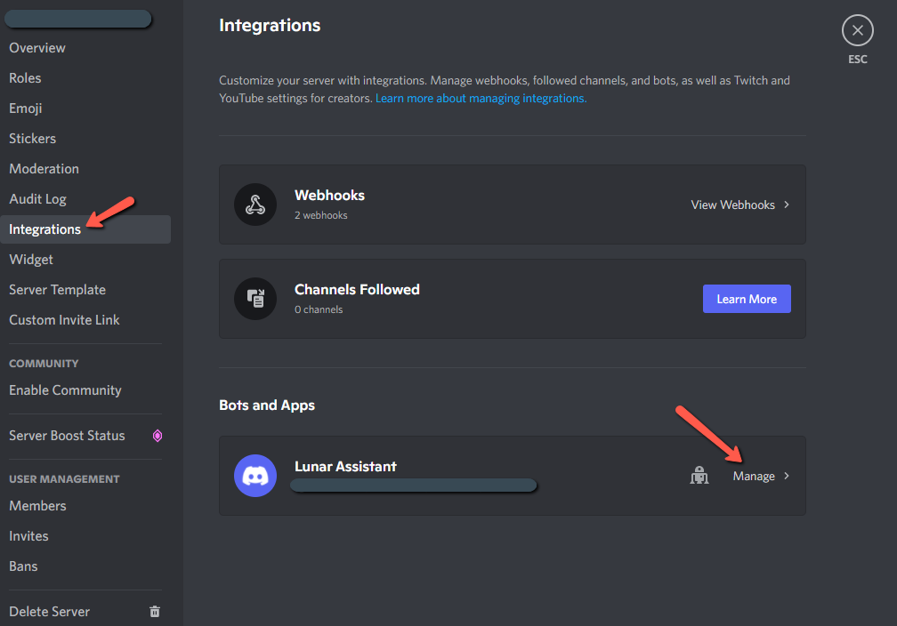

# User Guide Quick Start

## Linking A Wallet (supported network polygon)

Start by linking a wallet to your discord account with the Lunar Assistant by running `/lunar-link`. Example response:

.png>)

Click the link to visit the Lunar Assistant website, where you can link a wallet with your discord account.

.png>)

.png>)

.png>)

Linking your wallet is a two-step process. First, connect your wallet and sign a transaction proving ownership of the wallet. In the second step, link your discord and authorize the permissions required for the bot.&#x20;

.png>)

After signing the transaction and linking discord, you will see a message to return to Discord and run `/lunar-view-roles` to see what roles you have been granted.

## Viewing Roles

View your roles by running `/lunar-view-roles` from any Discord server with Lunar Assistant installed. The response message will list the roles you have been granted through Lunar Assistant based on the contents of your linked wallet.

## Viewing Linked Wallet

You can run `/lunar-view-wallet` any time to see which wallet address you have linked to your account.

## Disconnecting The Linked Wallet

You can run `/lunar-disconnect-wallet` to disconnect your discord account from your wallet address.

## Further Reading

To learn more about lunar assistant user commands, see the following reference:


[user-commands.md](../reference/command-reference/user-commands.md)


